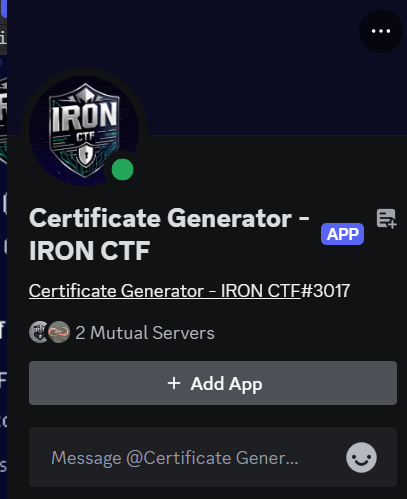
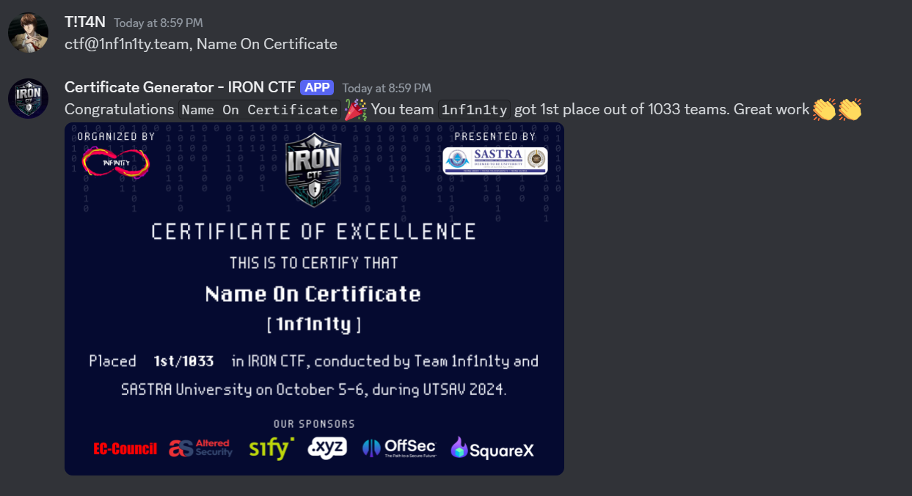

# Certificate Generator Discord Bot

## Get a Discord Bot Token

Follow these steps to create a Discord bot and retrieve its token:

### 1. **Create a Discord Application**

1. Visit the [Discord Developer Portal](https://discord.com/developers/applications).
2. Log in with your Discord account.
3. Click the **"New Application"** button in the top-right corner.
4. Give your application a name (e.g., "My Discord Bot") and click **"Create"**.

### 2. **Set Up a Bot**

1. In the left sidebar, go to the **"Bot"** section.
2. Click the **"Add Bot"** button and confirm the action.
   - Your bot is now created and will appear under the **Bot** section.

### 3. **Get the Bot Token**

1. Under the **Bot** section, locate the **"Token"** field.
2. Click **"Reset Token"** (if prompted) and confirm.
3. Copy the generated token by clicking the **"Copy"** button.
   - **Important:** Keep this token private. If someone else has access to it, they can control your bot.

### 4. **Invite Your Bot to a Server**

1. Go to the **OAuth2** section in the left sidebar.
2. Under **OAuth2 > URL Generator**:
   - Select **"bot"** under **Scopes**.
   - Under **Bot Permissions**, select the appropriate permissions your bot needs (e.g., `Read Messages`, `Send Messages`, etc.).
3. Copy the generated URL and paste it into your browser.
4. Select a server where you have "Manage Server" permissions and invite the bot.

## Setting Certificate discord bot

### Docker Compose

```bash
git clone https://github.com/Team-1nf1n1ty/Certificate-Generator-Discord-Bot.git
```

```bash
mv .env.example .env
```

### Steps to Configure and Run the Certificate Generation Bot  

1. **Update the Discord Bot Token**  
   - Open the `.env` file in your project directory.  
   - Replace the value of `DISCORD_API_KEY` with the bot token obtained from the [Discord Developer Portal](https://discord.com/developers/applications).  

2. **Customize the Certificate Template**  
   - Replace the default certificate template image in the project directory with your custom design.  
   - Ensure the new template is saved in the correct format and location as specified in the project documentation.  

3. **Adjust Configuration in `config.py`**  
   - Open the `config.py` file and update the following parameters to match your certificate design:  
     - `name_position`: Specifies the `(X, Y)` coordinates for placing the participant's name on the certificate.  
     - `team_position`: Specifies the `(X, Y)` coordinates for placing the team name on the certificate.  
     - `max_name_width`: Defines the maximum width allowed for the participant's name to ensure it fits well on the certificate.  
     - `max_team_width`: Defines the maximum width allowed for the team name on the certificate.  
     - `max_position_width`: Defines the maximum width for the team’s position (e.g. 41st/1033) on the certificate.  
     - `excellence_criteria`: Defines the threshold position at which a Certificate of Excellence should be awarded.
     - `font_path`: Path to the TTF file for the desired font.
   - These adjustments ensure that all text is correctly positioned and scaled on the certificate template.  

4. **Replace the Scoreboard Data**  
   - Download the latest `scoreboard.csv` file from the CTFd admin panel. This file contains the participant details and their scores.  
   - Replace the existing `scoreboard.csv` file in the project directory with the downloaded file.  

5. **Start the Bot to Generate Certificates**  
   - Use the following command to start the bot using Docker Compose:  

     ```bash
     sudo docker compose up
     ```

once the container is up you can see the bot's status is changed to online



Send a direct message to the bot with the format `ctf@1nf1n1ty.team, [name on certificate]`, and you will receive your appropriate certificate, whether it's for excellence or participation.



---

### Notes

- Make sure the Docker environment is properly installed and configured on your system.  
- Verify the configurations and template alignment with a test run before generating certificates for all participants.  
- For troubleshooting or additional customization, refer to the project documentation.  

By following these steps, the bot will efficiently generate personalized certificates for your CTF participants.
